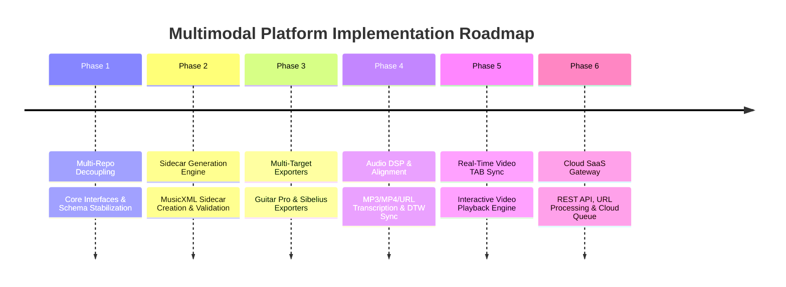

# Strategic Master Plan — Multimodal Audio & Score Intelligence Platform

## Executive Overview

This master plan establishes the long-term governance roadmap for evolving **ScoreToGP** into a complete **Multimodal Audio & Score Intelligence Platform**.

The ultimate objective is to ingest audio/video (MP3, MP4, stream URLs, or PDF scores), compile them into a unified intermediate representation ([`ScoreIR`](file:///home/tticom-codex/work/score2gp-workspace/score2gp-core/src/score2gp_core/__init__.py)), generate reliable MusicXML sidecars, and export target-specific score artifacts for **Guitar Pro**, **Sibelius**, and **Real-Time Synchronized Video Playback**.

---

## Governance Framework Alignment

Every task in this roadmap adheres strictly to the Score2GP governance model:
1. **Repository Scope Separation**: Core libraries (`score2gp-core`, `score2gp-vector-parser`, `score2gp-exporter`, `score2gp-audio`, `score2gp-cloud`) contain product code; `score2gp-agentops` holds governance control-planes and ADRs.
2. **Smallest Bounded Slices**: Every feature is delivered as an isolated Developer slice (`go`), validated by automated test suites and disconfirmation probes, and reviewed via formal governance (`got`).
3. **Evidence-Based Progression**: Progress requires reproducible single-run artifacts and passing safety gates. Passing tests alone do not equal task completion.

---

## Strategic Program Roadmap



---

## Detailed Task Breakdown by Phase

### Phase 1: Multi-Repo Core Infrastructure & Contract Stabilization
- [ ] **TSK-101**: Formalize `score2gp-core` API package exports (`ScoreIR`, `FretPositionSolver`, `DurationIR`) and publish versioned JSON Schema.
- [ ] **TSK-102**: Implement `score2gp-vector-parser` interface contract (`IVectorPDFParser`, `ISidecarGenerator`), decoupling vector PDF extraction from main CLI.
- [ ] **TSK-103**: Refactor `score2gp-exporter` plugin registry (`ExporterRegistry`) for modular target format registration.
- [ ] **TSK-104**: Migrate legacy `score2gp` CLI commands to consume `score2gp-core` and `score2gp-exporter` dependencies.

### Phase 2: Assisted Sidecar Generation Engine (MusicXML Sidecars)
- [ ] **TSK-201**: Implement `SidecarEvaluationResult` scoring harness in `score2gp-vector-parser` for automated MusicXML structural validation.
- [ ] **TSK-202**: Build PDFtoMusic Pro / PhotoScore sidecar import converter normalizing 6-line guitar tab staves to standard MusicXML staves.
- [ ] **TSK-203**: Implement automated MusicXML sidecar repair utility for unbalanced measure timing and missing divisions.
- [ ] **TSK-204**: Add sidecar diff & provenance audit tooling to `score2gp convert`.

### Phase 3: Multi-Target Exporter Suite (Guitar Pro & Sibelius)
- [ ] **TSK-301**: Harden `score2gp-exporter` Guitar Pro (`.gp`) binary packaging engine for GP6, GP7, and GP8 target profiles.
- [ ] **TSK-302**: Implement Sibelius-optimized MusicXML exporter (`SibeliusXMLExporter`) with explicit layout markers and instrument voicings.
- [ ] **TSK-303**: Create round-trip export validator verifying semantic fidelity across `.gp` and `.musicxml` outputs.

### Phase 4: Audio DSP, Pitch/Onset Transcription & DTW Alignment
- [ ] **TSK-401**: Implement `score2gp-audio` MP3/WAV/MP4 audio loader and DSP feature extractor (chroma, onset envelope, pitch candidate grid).
- [ ] **TSK-402**: Build Dynamic Time Warping (DTW) alignment engine mapping audio onset timestamps to `ScoreIR` measure timelines.
- [ ] **TSK-403**: Implement `SyncManifest` and `SyncPoint` exporter generating timestamped playback metadata.
- [ ] **TSK-404**: Add audio-to-sidecar alignment verification suite (`test_audio_score_alignment.py`).

### Phase 5: Real-Time Synchronized Video Playback Engine
- [ ] **TSK-501**: Define `InteractivePlaybackManifest` schema for real-time video overlay rendering (note highlight coordinates, cursor position, active fretboard state).
- [ ] **TSK-502**: Build `score2gp-exporter` real-time playback JSON/WebSockets stream exporter.
- [ ] **TSK-503**: Create public synthetic HTML5/Canvas video player fixture proving real-time synchronized TAB playback against MP4 video.

### Phase 6: Cloud SaaS Service & REST API Gateway
- [ ] **TSK-601**: Implement `score2gp-cloud` FastAPI gateway (`ScoreCloudGateway`) supporting `/v1/convert` for PDF, Audio, and Video URLs.
- [ ] **TSK-602**: Add YouTube / remote URL audio-video stream extractor service with local caching and privacy sanitization.
- [ ] **TSK-603**: Implement async conversion job queue (`ConversionJob`) and user API key authentication (`ApiKey`).
- [ ] **TSK-604**: Integrate Stripe billing & subscription tier enforcement (`StripeBillingService`).

---

## Task Queue Management & Promotion Protocol

Each task will be queued in `projects/score2gp/PLANNING_DATA.md` and activated sequentially via `ACTIVE_TASK.md`. Governance worker (`tticom-gov`) will dispatch tasks through the established identity-aware router:

```bash
python3 scripts/score2gp_dispatch.py --product ../score2gp --agentops . --json
```

No task will begin product implementation until its governing prompt is merged into `projects/score2gp/prompts/next/` and promoted in `ACTIVE_TASK.md`.
