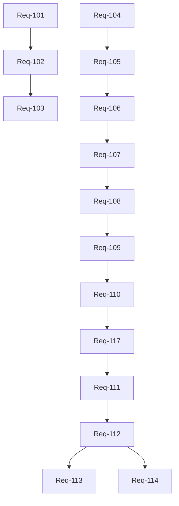

# Product Backlog Requirement Architecture

## 1. Product Outcome Hierarchy
- **Top-Level Goal**: Produce a reliable, measurable PDF-to-GuitarPro conversion pipeline without speculative guessing.
- **Level 1**: Strict agentic governance and execution safety (Control-Plane).
- **Level 2**: Robust extraction of physical and primitive optical geometry from PDFs.
- **Level 3**: Conversion of primitive geometry into intermediate candidate entities (lines, curves, bounding boxes).
- **Level 4**: Semantic identification boundaries (standard-staff detection, barline alignment) before note parsing.
- **Level 5**: Cautious, evidence-gated introduction of musical semantics (clefs, quarter rests, whole notes).
- **Level 6**: Final output rendering and GuitarPro export.

## 2. Prioritisation Model
Requirements are ranked strictly using the following scale:
- **P0**: Governance/control-plane prerequisite.
- **P1**: Active benchmark blocker or strict conversion blocker.
- **P2**: Semantic verification, oracle, or artifact-coherence blocker.
- **P3**: Workflow automation that reduces manual handoff.
- **P4**: Generalisation after active benchmark acceptance.
- **P5**: Deferred research or stress-case work.

## 3. Requirement Taxonomy
- **Task Types**: `Governance`, `Research`, `Diagnostic`, `Implementation`.
- **Owner Roles**: `Orchestrator`, `Architect`, `Reviewer`, `Developer`, `Researcher`.
- **States**: `Ready`, `Architect-first`, `Blocked`, `Deferred`.
- **Requirement Count**: 17 requirements (`Req-101` through `Req-117`).

## 4. Ordered Backlog Epics
1. **Epic A**: Control-Plane & Single-Prompt Workflow Automation (P0-P3)
2. **Epic B**: Geometry Candidate Extraction & Diagnostics Maturation (P1-P2)
3. **Epic C**: Semantic Boundary Definition & Core Interpretation (P2-P4)
4. **Epic D**: Advanced Notation & Structural Semantics (P4-P5)

## 5. Ordered Backlog Requirements under each Epic

### Epic A: Control-Plane & Single-Prompt Workflow Automation
- **Req-101**: Design single-prompt autonomous cycle workflow (P0, Architect-first, Active).
- **Req-102**: Reviewer architecture verification for single-prompt loop (P0, Ready).
- **Req-103**: Implement single-prompt autonomous cycle (P0, Ready, depends on Req-102).
- **Req-117 (Task 35)**: Post-geometry-candidate backlog refresh (P3, Ready, depends on Req-110).

### Epic B: Geometry Candidate Extraction & Diagnostics Maturation
- **Req-104 (Task 28)**: Add PDF geometry candidate extraction diagnostics skeleton (P1, Ready).
- **Req-105 (Task 29)**: Add candidate extraction JSON snapshot tests (P1, Ready).
- **Req-106 (Task 30)**: Add candidate snapshot regeneration helper (P1, Ready).
- **Req-107 (Task 31)**: Add candidate extraction CLI/reporting smoke path (P2, Ready).
- **Req-108 (Task 32)**: Add backwards compatibility test for diagnostics output (P2, Ready).
- **Req-109 (Task 36)**: Expose primitive-level geometry diagnostics (P2, Ready).
- **Req-110 (Task 33)**: Add product architecture review for geometry candidates (P2, Ready, depends on Req-108 and Req-109).

### Epic C: Semantic Boundary Definition & Core Interpretation
- **Req-119**: Semantic candidate JSON snapshot tests (P2, Ready).
- **Req-120**: Semantic candidate CLI/reporting smoke path (P2, Ready).
- **Req-121**: Fail-closed semantic coverage expansion (whole rests, polyphony) (P2, Ready).
- **Req-122**: Semantic candidate no-ScoreIR leakage gate (P2, Ready).
- **Req-111 (Task 34)**: Research-only semantic boundary proposal (P2, Architect-first, depends on Req-110).
- **Req-112**: Implement semantic boundary validation gate (P2, Architect-first).
- **Req-113**: Logical clef recognition candidate integration (P4, Architect-first).
- **Req-114**: Quarter rest extraction based on stable geometry (P4, Architect-first).

### Epic D: Advanced Notation & Structural Semantics
- **Req-115**: Rhythm interpretation pipeline (P5, Blocked).
- **Req-116**: Pitch inference from staff positioning (P5, Blocked).

## 6. Dependency Graph

## 7. Stop/Pivot Gates
- **Stop** if a task cannot produce measurable acceptance evidence.
- **Stop** if the approach depends on private fixtures, unsafe artifacts, or hidden assumptions.
- **Stop** if the next step requires implementing a deferred capability (e.g. pitch inference).
- **Pivot** if geometry diagnostics fail to cleanly distinguish artifacts (e.g., margins vs. staff curves).
- **Pivot** if backwards compatibility in existing diagnostics breaks without a clear migration path.

## 8. Definition of Ready for Queue Promotion
- Requirement fits in one PR.
- Target outcome is concrete (e.g., Outcome A, B, or C for Architect, specific tested feature for Developer).
- Contains strictly measurable acceptance criteria/evidence.
- Dependencies are clear and fully met.
- No private asset leakage is required.

## 9. Definition of Done for Requirement Completion
- Implementation meets all acceptance criteria.
- Adversarial Reviewer verification passes without unresolved comments.
- Artifacts and schema snapshots are strictly updated and backwards-compatible.
- PR merged to `main` by human maintainer.
- Post-merge validation on `main` passes.

## 10. First Queue-Ready Task Candidates

1. **Req-102**: `governance/single-prompt-cycle-reviewer-verification` (Ready, Tier B, Reviewer)
   - *Evidence Basis*: Reviewing the outcome of Req-101.
   - *Validation*: Review ledger generation and pass/fail logic.
2. **Req-103**: `governance/single-prompt-cycle-implementation` (Ready, Tier B, Developer)
   - *Evidence Basis*: Implementing approved workflow from Req-102.
   - *Validation*: Run script tests validating the handoff loop.
3. **Req-104 (Task 28)**: `pdf/geometry-candidate-extraction-diagnostics-skeleton` (Ready, Tier B, Developer)
   - *Evidence Basis*: Prior Architect approval for candidate extraction phase.
   - *Validation*: Tests checking candidate skeleton presence.
4. **Req-105 (Task 29)**: `pdf/geometry-candidate-json-snapshot-tests` (Ready, Tier B, Developer)
   - *Evidence Basis*: Deterministic JSON snapshots are needed for safe candidate extraction.
   - *Validation*: Pytest snapshot comparison on `fixtures/public/expected_geometry_candidates_*.json`.
5. **Req-106 (Task 30)**: `pdf/geometry-candidate-snapshot-regeneration` (Ready, Tier B, Developer)
   - *Evidence Basis*: Safe maintenance of test snapshots.
   - *Validation*: Regeneration script runs cleanly.
6. **Req-107 (Task 31)**: `pdf/geometry-candidate-reporting-smoke` (Ready, Tier B, Developer)
   - *Evidence Basis*: Ensure candidate layer can be safely inspected via CLI without breaking ScoreIR.
   - *Validation*: Diagnostics CLI command successfully outputs candidates.
7. **Req-108 (Task 32)**: `pdf/diagnostics-backwards-compatibility` (Ready, Tier B, Developer)
   - *Evidence Basis*: Need strict proof that exposing candidates did not break existing diagnostics keys.
   - *Validation*: Backcompat tests verifying legacy keys.
8. **Req-109 (Task 36)**: `pdf/primitive-geometry-diagnostics-exposure` (Ready, Tier B, Developer)
   - *Evidence Basis*: Needed to decouple upstream processes from aggregate counts.
   - *Validation*: Tests verifying serialization of geometry properties.
9. **Req-110 (Task 33)**: `review/geometry-candidate-layer-review` (Ready, Tier B, Reviewer)
   - *Evidence Basis*: Ensures all candidate layer tests pass before proceeding to semantics.
   - *Validation*: Verify tasks 28-32 and 36.
10. **Req-117 (Task 35)**: `governance/post-geometry-candidate-backlog-refresh` (Ready, Tier B, Orchestrator)
    - *Evidence Basis*: Keeps control-plane up-to-date after major architecture gate.
    - *Validation*: `APPROVED_TASK_QUEUE.md` reflects accurate state.
11. **Req-111 (Task 34)**: `pdf/semantic-boundary-research-proposal` (Architect-first, Tier A, Architect)
    - *Evidence Basis*: Needs concrete evidence on how to safely proceed into standard-staff interpretation.
    - *Validation*: Produced documentation identifying the first safe semantic task.

## 11. Explicit Deferred/Deprioritised Work
- **Pitch Inference**: Deferred because robust staff-line geometry and clef detection must be fully solved first. Attempting it now leads to guessing.
- **Rhythm/Duration Inference**: Deferred due to unreliability of stem/flag detection at current abstraction level.
- **Voice Assignment**: Deferred.
- **Scanned/OCR PDF Support**: Deferred. The system strictly processes natively rendered PDFs first.
- **Geometry Cluster Playback Integration**: Deferred. Geometry diagnostics must remain diagnostic-only until explicitly approved for semantic mapping.

## 12. Evidence Ledger
- **Req-101/102/103**: Supported by PR #338 and PR #247 (status bootstrap logic) which indicate Orchestrator turnaround is the active blocker.
- **Req-104 to 108**: Supported by the merged Architect decision to transition from primitive clusters to structured geometry candidates (`projects/score2gp/decisions/`).
- **Req-109 (Task 36)**: Supported by the need to resolve primitive instances to precise coordinate fields as verified by `tests/test_pdf_geometry.py`.
- **Req-110 (Task 33)**: Supported by the need to verify tasks 28-32 and 36 before proceeding to semantic interpretation.
- **Req-111**: Supported by `projects/score2gp/AGENT_CONTROL.md` forbidding semantic event mapping from geometry without prior explicit architecture review.
- **Req-117 (Task 35)**: Supported by the control-plane requirement to refresh the backlog after the geometry-candidate architecture gate completes.
