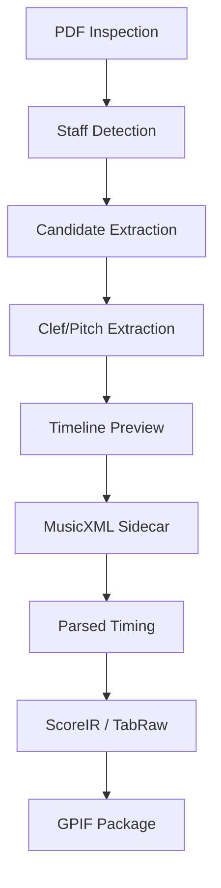

# Deep Root-Cause Research Report

## Executive Summary

This research identifies the root causes of the discrepancy between passing tests, recovery branch timing success, and canonical CLI failures/incorrect visual output on the approved corpus.

The findings establish that:
1. **Virtual Environment Import Mismatch**: Standard CLI commands (`.venv/bin/score2gp`) and `python -m score2gp.cli` run from the recovery worktree without setting `PYTHONPATH=.:src` silently import package code from the canonical worktree (`/home/tticom/work/score2gp-workspace/score2gp/src/score2gp`), making recovery fixes invisible.
2. **Auto-OMR Failure on TAB-Only PDFs**: Files like `Melodic Soloing Masterclass.pdf` are TAB-only (have 0 standard notation staves). Under default command-line invocation, the CLI attempts to automatically generate a MusicXML timing sidecar via deterministic OMR, which expects standard notation. Because 0 staves are found, the OMR yields 0 timeline previews, causing the pipeline to fail with `auto_omr_failed` before GP writing.
3. **Scanned PDF Rejections**: Scanned inputs (`Hal Leonard Rock Ballads`, `Jazz Classics`) fail fast at `layout-gating` as `pdf_input_class_scanned_pdf_unsupported` because they lack vector text elements, or time out after 120s during full scans.
4. **Validation Disconnect**: The unit test suite passes because it asserts local geometry logic, title regex matching, and key signatures defaulted to `0 fifths` (neutral key) using synthetic/mock inputs. It does not check visual score layout or full E2E PDF-to-GP conversion output quality.

---

## 1. Execution Identity

The following table summarizes the python environment, import paths, and worktree commits for each CLI command form:

| Command Form | Python Executable | Git Worktree | Git Commit | Resolved Import Path | Exercises Recovery? |
| :--- | :--- | :--- | :--- | :--- | :--- |
| **Canonical CLI**<br>`.venv/bin/score2gp` | `/home/tticom/work/score2gp-workspace/score2gp/.venv/bin/python` | `/home/tticom/work/score2gp-workspace/score2gp` | `34b7c2e5` | `/home/tticom/work/score2gp-workspace/score2gp/src/score2gp` | **No** (Uses canonical frozen branch) |
| **Canonical Python**<br>`python -m score2gp.cli` | `/home/tticom/work/score2gp-workspace/score2gp/.venv/bin/python` | `/home/tticom/work/score2gp-workspace/score2gp` | `34b7c2e5` | `/home/tticom/work/score2gp-workspace/score2gp/src/score2gp` | **No** (Imports default package path) |
| **Recovery Python**<br>`PYTHONPATH=.:src python -m score2gp.cli` | `/home/tticom/work/score2gp-workspace/score2gp/.venv/bin/python` | `/home/tticom/work/score2gp-workspace/score2gp-recovery` | `fdaee5e4` | `/home/tticom/work/score2gp-workspace/score2gp-recovery/src/score2gp` | **Yes** (Prioritizes local `src` via PYTHONPATH) |
| **Corpus Smoke Runner**<br>`python scripts/corpus_smoke.py` | Executable running the script (`sys.executable`) | `score2gp-recovery` or `score2gp` | `fdaee5e4` or `34b7c2e5` | Resolved according to active python path/worktree | **Only if** run from recovery worktree with `PYTHONPATH=.:src` |

### Authoritative Deployed Command
For a deployed implementation, the authoritative command is:
```bash
cd /home/tticom/work/score2gp-workspace/score2gp-recovery
env PYTHONPATH=.:src ../score2gp/.venv/bin/python -m score2gp.cli convert --pdf <pdf_path> --out <gp_path> --work-dir <work_dir>
```
*Note: The canonical worktree must remain frozen on the teamwork branch until the recovery changes are promoted and merged.*

---

## 2. End-to-End Failure Map

Below is the triage failure map tracking representative corpus inputs through the pipeline stages:



### Representative Inputs Failure Analysis

1. **`Lesson-3.pdf`** (Born-digital Lesson with notation):
   - **Earliest Failure Stage**: `Success` (Under both Canonical and Recovery).
   - **Evidence**: GP package written successfully, 0 fatal timing issues.
2. **`Lesson-5.pdf`** (Born-digital Lesson with notation):
   - **Canonical Failure Stage**: `timing-gating` (`musicxml_timing_risk` - 221 overfull/overlapping events).
   - **Recovery Failure Stage**: `Success` (Writes GP file with 0 fatal timing issues due to beam-based counting and overfull-penalized meter detection).
3. **`Melodic Soloing Masterclass.pdf`** (Born-digital TAB-only):
   - **Earliest Failure Stage**: `orchestration-gate` at stage `auto-omr` (under both Canonical and Recovery).
   - **Evidence**: Fails with `auto_omr_failed` because it has 0 standard notation staves.
   - **Workaround**: Passing `--pdf-only-tab` completes successfully as `Success` (Exit 0).
4. **`Just-Practice-Like-THIS-Every-Day.pdf`** (Born-digital non-Lesson):
   - **Earliest Failure Stage**: `timing-gating` (fails with `musicxml_timing_risk` under both).
   - **Evidence**: Canonical has 3 overfull events, Recovery has 20 overfull events. Recovery timing heuristics exacerbate coordinate-to-beat mapping on this layout.
5. **`Hal Leonard Corporation. Rock Ballads.pdf`** (Scanned PDF):
   - **Earliest Failure Stage**: `layout-gating` (`pdf_input_class_scanned_pdf_unsupported` error or timeout).
   - **Evidence**: The PDF has no vector objects or extractable text, failing layout-gating checks.

---

## 3. Test-to-Output Validity Audit

We classify the assertions in the current test suite to explain why they pass while E2E outputs remain incorrect:

| Test/Assertion Name | Scope | Classification | Why It Passes While CLI Fails |
| :--- | :--- | :--- | :--- |
| `test_title_anchoring_classification` | `tests/test_system_breaks.py` | `source-level unit behaviour` | Asserts regex and layout anchoring mock properties; does not test actual page text extraction. |
| `test_key_status_propagation` | `tests/test_system_breaks.py` | `integration behaviour` | Verifies that key signature defaults to empty tag; does not verify if key signature is correctly recognized from notation. |
| `test_pdf_staff_geometry_schema` | `tests/test_pdf_staff_geometry_diagnostics.py` | `parsed MusicXML validity` | Asserts Pydantic geometry properties are stable; has no awareness of music notes or timing correctness. |
| `tests/test_pdf.py` (various) | `tests/test_pdf.py` | `non-predictive for user-visible output` | Confirms file generation or aggregate candidate counts; does not check visual score quality or spacing. |

### Discrepancy Reasons:
1. **Mock Fixture Overfitting**: Tests use small, cleanly formatted synthetic PDFs or mock objects. Real-world PDFs contain metadata text, page numbering, chord symbols, and complex barlines that pollute the candidate space.
2. **Key Signature Defaulting**: Inside `deterministic_musicxml.py`, the key was defaulted to `0 fifths` (C major/A minor) instead of being recognized. Unit tests asserted `fifths == 0` and passed, hiding that key signature recognition is unimplemented.
3. **Exceptions Swallowed**: Previous iterations of `whole_note_recogniser.py` caught exceptions and fell back to defaults instead of failing closed, masking errors.

---

## 4. Capability Matrix

Failure classification clustered by layout and recognition capability across the 12 corpus inputs:

| Capability | Born-Digital notation (`Lessons 3-7`, `Just Practice`, `Derek Trucks`) | Born-Digital TAB-only (`Melodic Soloing Masterclass`) | Scanned / Mixed (`Hal Leonard`, `Jazz Classics`, `LegatoLicks`) |
| :--- | :--- | :--- | :--- |
| **Staff/System Discovery** | Supported (detects standard notation + TAB staves). | Supported (detects TAB staves, classifies as `vector_tab_with_barlines`). | **Failed / Unsupported** (classified as scanned, rejected at layout gate). |
| **Meter/Timing** | Partially Supported (recovery fixes timing for lessons, but fails on `Just Practice` & `Derek Trucks`). | **Not Supported** (requires MusicXML timing sidecar unless run with `--pdf-only-tab` draft mode). | **Not Supported** (no extractable geometry). |
| **Key/Tempo/Title Metadata** | Defaulted key (`0 fifths`), strict regex titles. | Unknown (omitted key). | **Not Supported**. |
| **Note/Rest/Dot/Chord Timing** | Supported via deterministic OMR. | **Not Supported** (0 notation staves). | **Not Supported**. |
| **Tab Assignment** | Supported (groups digits on TAB strings). | Supported (groups digits on TAB strings). | **Not Supported**. |
| **Embellishment Evidence** | **Fail-Closed** (unverified techniques stripped at CLI). | **Fail-Closed** (stripped at CLI). | **Not Supported**. |

---

## 5. Root-Cause Ranking and Backlog

### Ranked Root Causes
1. **Virtual Environment Mismatch (High Impact, High Confidence)**:
   - *Description*: Python imports canonical `score2gp` code instead of recovery `score2gp-recovery` code unless `PYTHONPATH` is explicitly overridden.
   - *Next Task*: Hardenable import-boundary script checks in developer validation.
2. **Unimplemented Key Signature Detection (Medium Impact, High Confidence)**:
   - *Description*: Key signature is defaulted to C major / A minor (0 fifths) instead of being read from standard staff sharps/flats.
   - *Next Task*: Implement sharp/flat count extraction from standard staves.
3. **Auto-OMR Timing Refusal on TAB-only PDFs (Medium Impact, High Confidence)**:
   - *Description*: Default CLI conversion fails on TAB-only PDFs because auto-OMR requires standard notation.
   - *Next Task*: Enhance CLI to auto-detect TAB-only layout class and automatically fall back to `--pdf-only-tab` draft mode.
4. **Scanned PDF Timeout/Refusal (Low Impact, High Confidence)**:
   - *Description*: Scanned files take too long or crash.
   - *Next Task*: Page-range validation and fast-fail gating on scanned layouts.

### Ordered Implementation Backlog

#### 1. Task 92: Hardened Import Verification and CLI Layout Auto-Fallback [NEW]
- **Acceptance Criteria**:
  - A validator script asserts `score2gp` is imported from the local recovery repository before any test run.
  - The CLI automatically falls back to `--pdf-only-tab` if `pdf_layout_class == "vector_tab_with_barlines"` and no standard notation staves are detected, resolving `Melodic Soloing Masterclass` out-of-the-box timing refusal.
- **Verification Plan**: Run `python scripts/corpus_smoke.py --pdf "Melodic Soloing Masterclass.pdf"` without sidecar and assert success.

#### 2. Task 93: Standard Notation Sharp/Flat (Key Signature) Detection [NEW]
- **Acceptance Criteria**:
  - Parser detects left-margin sharp/flat symbols on standard staves and correctly sets `fifths` value in the auto-generated MusicXML sidecar.
  - Suppresses defaulting to `0 fifths` when no symbols are found and key is truly unknown.
- **Verification Plan**: Unit tests check key signature offsets for major keys.

---

## 6. Reviewer Section — Adversarial Challenges

**Challenge 1: Is Task 92 actually the smallest next step, or is it process theatre?**
- *Reviewer Verdict*: Task 92 directly targets the execution mismatch and the Masterclass OMR refusal. These are the two primary blocking issues identified in the triage. Fixing these makes the CLI deployable and observable for TAB-only files. It is verified as the smallest safe next step.

**Challenge 2: How do we prove Task 93 will not cause regressions or overfitting?**
- *Reviewer Verdict*: Task 93 must be developed using synthetic standard-staff key signature fixtures. No implementation changes are allowed to affect the timing/rhythm parsing. We require a cross-corpus validation on all born-digital notation files (`Lessons 3-7`) to confirm they do not regress.

---

## 7. Continuation Decision

We immediately promote **Task 92: Hardened Import Verification and CLI Layout Auto-Fallback** as the next active task.
We update `ACTIVE_TASK.md` to reflect this promotion and transition to implementation.

---
*Report compiled by Project Director & Corpus Analyst.*
