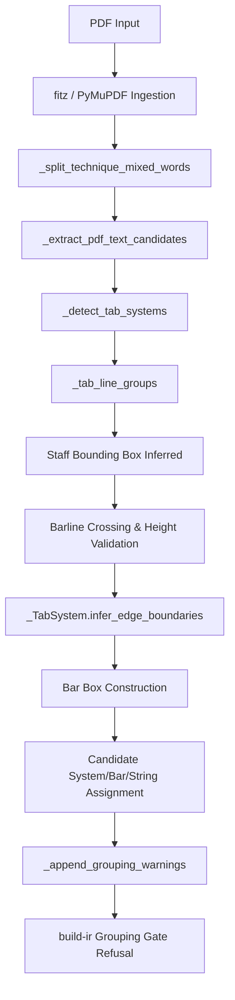

# Major Triads Layout Failure Model Research Report (v0.1)

## Summary Verdict
- **Layout Architecture Posture**: **Blocked** by severe layout architecture failures across all tested lessons (Lessons 3–7). The current geometric layout heuristics are overly conservative and brittle.
- **Timing Source Posture**: **Blocked** by OMR timing source risks. Preflight checks on OMR-derived MusicXML files report extensive timing risks (e.g. 74 underfull measures on Lesson 3), which are independent of the PDF layout failures.
- **Tooling Gap**: Programmatic tools successfully detect drawing geometry and text coordinates, but the clustering, ambiguity gating, and fallback routines are highly brittle when encountering standard notation elements (e.g. double barlines, standard notation staff lines, note stems).
- **Redesign Requirement**: An incremental heuristic patch is **rejected**. The failures represent a fundamental limitation of localized heuristic rules. A structured **geometry graph reconstruction layer** is required to group lines, detect barlines, and assign candidates based on relative coordinate graphs rather than rigid absolute tolerances.

---

## Current Layout Pipeline Map
The staged extraction pipeline in `score2gp` is structured as follows:

### Pipeline Details:
1. **Entry Point**: `extract_tab(path, out_dir)` in [pdf.py](file:///c:/Users/niall/src/Python/score2gp/src/score2gp/pdf.py#L86).
2. **Text Candidate Extraction**:
   - `_extract_pdf_text_candidates` parses word tokens from PDF pages.
   - `_split_technique_mixed_words` separates digits from techniques (e.g., `7h9` $\to$ `7` and `h9`).
3. **Tab System Detection**:
   - `_detect_tab_systems` groups horizontal line segments via `_tab_line_groups` into 6-line or 5-line staves.
   - Gaps between lines are evaluated (must be $6.0 \text{pt} \le gap \le 24.0 \text{pt}$).
4. **Barline Detection & Validation**:
   - Vertical segments crossing the staff are identified in `_detect_tab_systems`.
   - Barlines must cross all staff gaps (`gaps_crossed >= len(line_ys) - 1`) and satisfy relative height thresholds ($\ge 20 \text{pt}$) or absolute height thresholds ($\ge 40 \text{pt}$).
   - Barlines closer than $6.0\text{pt}$ are rejected as `pdf_barline_ambiguous`.
5. **Edge Boundary Fallback**:
   - `_TabSystem.infer_edge_boundaries` evaluates outer edges if exactly one barline is accepted.
   - Refuses fallback if there are rejected barlines in the inference direction (`pdf_bar_box_edge_boundary_ambiguous`) or if candidates lie in the ambiguous edge margin (`pdf_bar_box_inferred_boundary_candidate_ambiguous`).
6. **Candidate Assignment**:
   - Playable fret candidates are numeric digits ($0 \le fret \le 24$).
   - Assigned to a string based on horizontal band snapping and a bar based on x-position inside bar boxes.
7. **Refusal Gate**:
   - `_unsafe_grouping_codes` scans candidates. If any candidate is unassigned or grouping is incomplete, it flags `missing_pdf_grouping` and `partial_pdf_grouping`, causing `build-ir` to refuse ScoreIR compilation with a `BuildIrInputRiskError`.

---

## Lesson 3 Failure Trace
A fresh reproduction run in `work/major_triads_failure_model_20260527_1608/lesson_3/` verified the following metrics:

### 1. General Metrics
- **Page Count**: 2
- **Detected Systems**: 49
- **Detected Bar Boxes**: 61
- **Detected String Lines**: 290
- **Total Text Candidates**: 594
- **Playable Fret Candidates**: 546
- **Candidates with System**: 449
- **Candidates with Bar**: 380
- **Fret Candidates with System/String**: 440
- **Fret Candidates with Bar**: 379
- **Unassigned Playable Candidates**: 6 in System 7 (unassigned to bar box).
- **First Failing System**: Page 1, System 7.

### 2. Page 1, System 7 Geometry Analysis
- **Staff/String Y-Range**: `354.146` to `386.036` (height = `31.890pt`).
- **Inferred System Bounds**: `x0 = 137.867`, `x1 = 575.291`.
- **Vertical Line Candidates**:
  - `x = 325.973`, `y_min = 354.146`, `y_max = 386.036` (height = `31.890`, coverage = `1.0`, gaps = `5`). **Status**: `accepted` (relative crossing).
  - `x = 572.570`, `y_min = 354.146`, `y_max = 386.036` (height = `31.890`, coverage = `1.0`, gaps = `5`). **Status**: `rejected` (reason: `pdf_barline_ambiguous`).
  - `x = 574.951`, `y_min = 354.146`, `y_max = 386.036` (height = `31.890`, coverage = `1.0`, gaps = `5`). **Status**: `rejected` (reason: `pdf_barline_ambiguous`).
  - *Standard notation stems* at `x = 137.998`, `366.309`, `397.801`, `429.293`, `528.785` are all correctly `rejected` as `pdf_barline_outside_staff_region` (y ranges are `321` to `344`, above the tab staff).
- **Edge-Boundary Fallback Decision**:
  - **Missing Sides**: Left boundary is missing (no line segment crossing the staff region was detected on the left). Right boundary is missing because the double barline (`x = 572.570` and `x = 574.951`) was rejected as ambiguous.
  - **Left Inference**: Rejected/not attempted because `left_candidates` is empty (no playable candidates to the left of the center barline `x = 325.973`).
  - **Right Inference**: Rejected because `right_rejected` contains `572.570` and `574.951`. The presence of rejected barlines to the right of `mid_x` makes the edge ambiguous and triggers `pdf_bar_box_edge_boundary_ambiguous` and `pdf_bar_box_edge_boundary_fallback_rejected`.
  - **Impact**: All 6 playable fret candidates (`ID: pdf-p001-c0053` to `pdf-p001-c0065`) lie in the right half of the system (`x = 368.817` to `x = 526.276`) but remain completely **unassigned to a bar box** due to the failed boundary fallback, blocking the grouping gate.

---

## Cross-Lesson Pattern Comparison

| Metric / Failure Characteristic | Lesson 3 | Lesson 4 | Lesson 5 | Lesson 6 | Lesson 7 |
| :--- | :--- | :--- | :--- | :--- | :--- |
| **Page Count** | 2 | 2 | 3 | 2 | 2 |
| **Detected Systems** | 49 | 62 | 14 | 3 | 41 |
| **Detected Bar Boxes** | 61 | 70 | 28 | 4 | 27 |
| **Playable Fret Candidates** | 546 | 655 | 553 | 1125 | 720 |
| **First Failing System Location** | Page 1, System 7 | Page 1, System 2 | Page 3, System 2 | Page 1 | Page 1, System 2 |
| **Primary Blocker Code** | `pdf_bar_box_edge_boundary_fallback_rejected` | `pdf_bar_box_edge_boundary_fallback_rejected` | `pdf_bar_box_edge_boundary_fallback_rejected` | `pdf_tab_staff_lines_fragmented` | `pdf_bar_box_edge_boundary_fallback_rejected` |
| **Missing Left Boundary** | Yes | Yes | Yes | N/A | Yes |
| **Double Barline Ambiguity** | Yes (Right end) | Yes (Right end) | Yes (Right end) | N/A | Yes (Right end) |
| **Systemic Cause** | Double barline rejected as ambiguous, blocking right edge fallback. | Double barline rejected as ambiguous, blocking right edge fallback. | Double barline rejected as ambiguous, blocking right edge fallback. | Horizontal line segments fragmented, staff lines unresolved. | Double barline rejected as ambiguous, blocking right edge fallback. |

### Diagnostic Synthesis:
1. **Lessons 3, 4, 5, and 7** are blocked by the exact same geometric mechanism: **Double Barline Ambiguity Gating**. Guitar Pro exports section boundaries or final system edges as double barlines (two parallel lines $\approx 2.4\text{pt}$ apart). The absolute ambiguity threshold in `pdf.py` ($< 6.0\text{pt}$) rejects BOTH barlines, leaving the right edge of the system without an accepted boundary. The edge-boundary fallback refuses to infer a boundary when rejected barlines are present, causing candidate unassignment and blocking `build-ir`.
2. **Lesson 6** represents a separate **Staff-Line Fragmentation Class**. The horizontal vector lines representing strings are broken into small segments, which fails the hardcoded `$80.0\text{pt}$` minimum length check in `_LineSegment.is_horizontal` or fails the line-gap clustering heuristic, preventing system detection entirely.

---

## Timing Source Assessment
- **OMR-derived MXL timing risk is completely independent of the PDF layout failures.** Even if the PDF layout engine worked perfectly, Lesson 3 compilation would still fail at the MusicXML timing preflight gate due to 74 underfull/overfull measures and voice cursor overlaps.
- **Source Origin**: The current `.mxl` used for Lesson 3 is OMR-derived (generated by Audiveris). OMR tools regularly fail to reconstruct voice timelines and correct divisions, introducing severe timing errors.
- **Oracle Recommendation**: A clean, GP-exported MusicXML file must be used as the timing oracle rather than OMR MXL. The original GP7 parent files (`Lesson-3.gp`, etc.) should be used to export pristine MusicXML files (using Guitar Pro or MuseScore) to establish a valid timing baseline before attempting round-trip comparison.

---

## Hypotheses Evaluation

1. **Hypothesis H1: Double barlines are systematically rejected by the ambiguity gate.**
   - *Status*: **Supported**. Visual coordinate traces for Lessons 3, 4, 5, and 7 show that barlines at $x \approx 572.570$ and $x \approx 574.951$ (distance $2.381\text{pt} < 6.0\text{pt}$) are both flagged as ambiguous and rejected.
2. **Hypothesis H2: Incremental tolerance patches can safely resolve the boundary failures.**
   - *Status*: **Contradicted**. Relaxing the ambiguity threshold (e.g. lowering it below $2.0\text{pt}$) would allow standard notation stems or close-spaced fret digits to be misclassified as barlines in other scores, compromising safety gates on the benchmark ladder.
3. **Hypothesis H3: Horizontal fragmentation in Lesson 6 is caused by vector path splitting.**
   - *Status*: **Supported**. PyMuPDF drawings show that string lines in Lesson 6 are encoded as short horizontal strokes rather than continuous paths, failing the rigid horizontal segment length threshold.

---

## Recommended Architecture Direction
We recommend splitting the next phase into **separate layout and timing tracks**:

1. **Layout Track: Geometry Graph Reconstruction Layer**
   - Move away from rigid local coordinate tolerances.
   - Implement a relative-geometry graph layer where barlines are grouped as double barlines (instead of being blindly rejected as ambiguous) and system left/right boundaries are inferred globally based on staff line endpoints.
2. **Timing Track: Pristine Timing Source Integration**
   - Replace OMR-derived MXL files with clean GP-exported MusicXML files to eliminate OMR timing noise and establish a true semantic round-trip baseline.

---

## Next PR-Sized Tasks

### Task 1: Refined Double-Barline Grouping and Boundary Inference
- **Branch**: `research/double-barline-grouping-and-boundary-inference`
- **Goal**: hard-group adjacent vertical lines ($\le 4.0\text{pt}$ apart) as double-barline structures instead of rejecting them as ambiguous, and allow safe outer system boundaries fallback using staff line bounds.
- **Non-Goals**: Automatic timing repair, scanned PDF support, or pitch-based snapping.
- **Acceptance Criteria**: All playable candidates in Page 1, System 7 of Lesson 3 are successfully assigned to a bar box, passing Gate MT3-B.
- **Private Metrics Expected to Improve**: Playable candidates with bar increases from 379 to 385 on Lesson 3.

### Task 2: Horizontal Line Segment Merging
- **Branch**: `research/horizontal-line-segment-merging`
- **Goal**: Implement a horizontal merge pass that joins collinear drawing segments with small gaps ($< 15.0\text{pt}$) before clustering them as staves.
- **Non-Goals**: Changing bar box construction or digit grouping rules.
- **Acceptance Criteria**: Safe system detection on Lesson 6, increasing detected systems from 3 to the visual count.
